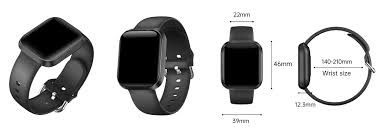

# The Wearable: MATRIX activity monitor

The wearable device selected by the expert group for the IMPaCT cohort is capable of recording six types of signals. It includes a triaxial accelerometer that captures movement along three body axes (x, y, z), an environmental temperature sensor, a body temperature sensor, and a photoplethysmography (PPG) sensor that provides information on heart rate and heart rate variability. 

The use of this device places the IMPaCT cohort at the forefront of physical activity and health monitoring using wearable technology. Importantly, the protocol also incorporates the simultaneous use of two devices: one worn on the wrist, collecting all six signals, and another worn on the thigh, providing three additional acceleration signals. This dual-location setup allows the collection of nine biomechanical and physiological signals, significantly enhancing measurement accuracy compared to single-location monitoring.

This approach is unique among large-scale cohorts, as previous studies have relied exclusively on accelerometry data, typically from a single body location. While this methodology enables the collection of exceptionally rich and high-quality data, it also poses substantial analytical challenges. Each participant generates nearly 400 million data points over a 7-day continuous monitoring period (24 hours per day), requiring advanced large-scale data processing and algorithm development. The analysis of these data will provide valuable insights not only into physical activity, but also into broader health domains such as sleep, chronobiology, and the detection of chronic and infectious diseases.

# MATRIX for the IMPaCT

- [Vídeo explicativo de colocación, programación y descarga](https://youtu.be/U4BEnQwD80s)

- [Video explicativo de instalación de la aplicación MATRIX en teléfono Android](https://www.youtube.com/watch?v=mnXzZG3uTSI)

- [Protocolo de acelerometría IMPaCT](https://drive.google.com/file/d/1enUvaSX1R2ahuztUOFWtrJwmjEgE1tOn/view?usp=share_link)

# MATRIX Technical Info

- The repository https://github.com/SiMuR-UO/matrix-wearable-monitor.git contains basic information about the wearable (an app to convert raw BIN files into CSV and documentation of the encoding of the .BIN file).
