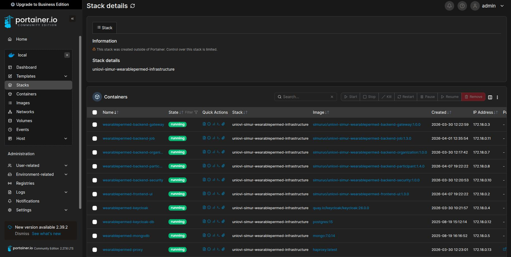

# Description

This section is about the architecture followed by the WearablePerMed Portal. The architecture used to implement this solution is a polyglot microservices pattern. The principal characteristics are:

- A Secure solution using the standard OAuth 2.0.
- A Multitenant solution to support several organizations at the same time.
- A Microservice architecture using Docker Containers.
- A decoupled solution using external Docker images to implement classifiers.
- A Rich Internet Application (RIA) for UI.

## Microservices

The system follows a polyglot microservices pattern because we use three different languages for its implementation:

- **Java (SpringBoot)**: to implement the business logic of the system
- **Python**: to implement the machine learning logic of the system
- **TypeScript, HTML, and SCSS**: to implement the UI logic of the system

We can divide these services in two groups:

- **Infrastructure services**: these services support the infrastructure, such as state, security, and access control to the system. The following table shows the list of all infrastructure microservices:

| Name                           | Image                                               | Version | Description |
| ------------------------------ | --------------------------------------------------- | ------- | ------------ |
| wearablepermed-keycloak        | quay.io/keycloak/keycloak                           | 26.0.0  | [Keycloak (Red Hat)](https://www.keycloak.org/) implementing the Identity and Access Management solution implemented by Red Hat |
| wearablepermed-keycloak-db     | postgres                                            | 15      | [PostgreSQL (SQL Database)](https://www.postgresql.org/) used by Keycloak to manage the state of the service |
| wearablepermed-mongodb         | mongo                                               | 7.0.14  | [(No SQL Database)](https://www.mongodb.com/) to manage the system microservices state |
| wearablepermed-proxy           | haproxy                                             | latest  | [haproxy proxy](https://www.haproxy.com/) to redirect any external requests to the internal SIMUR nodes |

- **Business microservices**: these microservices implement the business domain of our system using the languages already explained in the previous section. The following table shows the list of all microservices:

| Name                           | Image                                               | Version | Language          |  Description |
| ------------------------------ | --------------------------------------------------- | ------- | ----------------- | ------------ |
| wearablepermed-backend-gateway | simuruo/uniovi-simur-wearablepermed-backend-gateway | 1.0.0   |  SpringBoot (Java) | Gateway pattern to redirect any requests to the appropriate microservice |
| wearablepermed-backend-job | simuruo/uniovi-simur-wearablepermed-backend-job         | 1.3.0   |  SpringBoot (Java) | Implements the backend job that executes the predictor as a Docker container when trying to analyze any resource, integrated with Docker|
| wearablepermed-backend-organization | simuruo/uniovi-simur-wearablepermed-backend-organization | 1.0.0   | SpringBoot (Java) | Implements the backend system business model infrastructure, such as organizations, projects, images, and cases of the system |
| wearablepermed-backend-participant | simuruo/uniovi-simur-wearablepermed-backend-participant | 1.4.0   | SpringBoot (Java) | Implements the backend system business model infrastructure, such as participants, resources, and predictions of the system|
| wearablepermed-backend-security | simuruo/uniovi-simur-wearablepermed-backend-security | 1.0.0   |  SpringBoot (Java) | Implements the backend security model infrastructure, such as users, roles, and integration with Keycloak |
| wearablepermed-frontend-ui | simuruo/uniovi-simur-wearablepermed-frontend-ui | 1.3.0   | Angular (typescript, html, scss) | Implements the frontend interface to interact with the system through all backend microservices |
| uniovi-simur-wearablepermed-backend-job-predictor | simuruo/uniovi-simur-wearablepermed-backend-job-predictor | 1.21.0  | The Docker image implementing all the machine learning models to be used for classification. This Docker image uses the latest Python library called [uniovi-simur-wearablepermed-predictor](https://pypi.org/project/uniovi-simur-wearablepermed-predictor/). This image is instantiated on demand whenever it is requested to analyze a participant resource, so the container created by Docker is a job that will be removed when this service finalizes its work, so it only exists during this time interval. This image is instantiated by the service called **wearablepermed-backend-job** |

This screenshot shows all microservices inside the Docker stack called **uniovi-simur-wearablepermed-infrastructure**:

Finally, we can see in this deployment diagram all the services and their relations:

