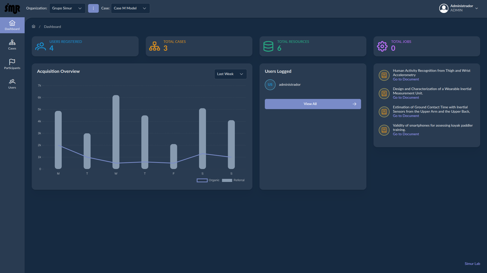
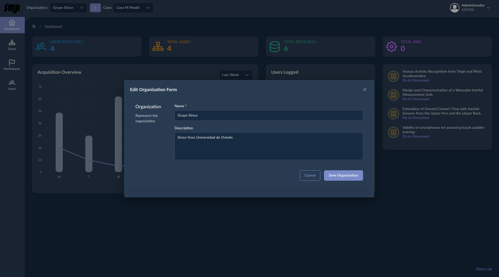
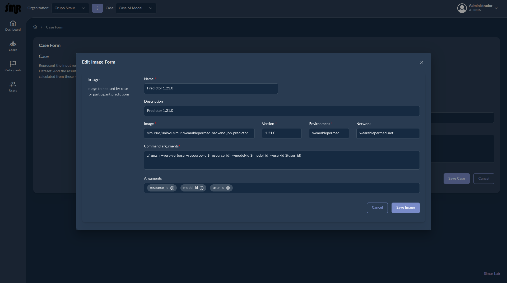
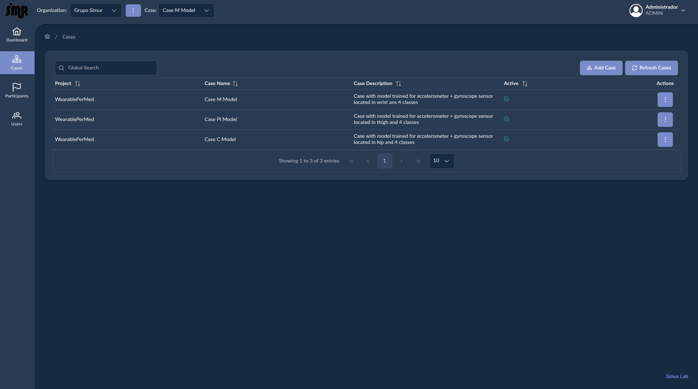
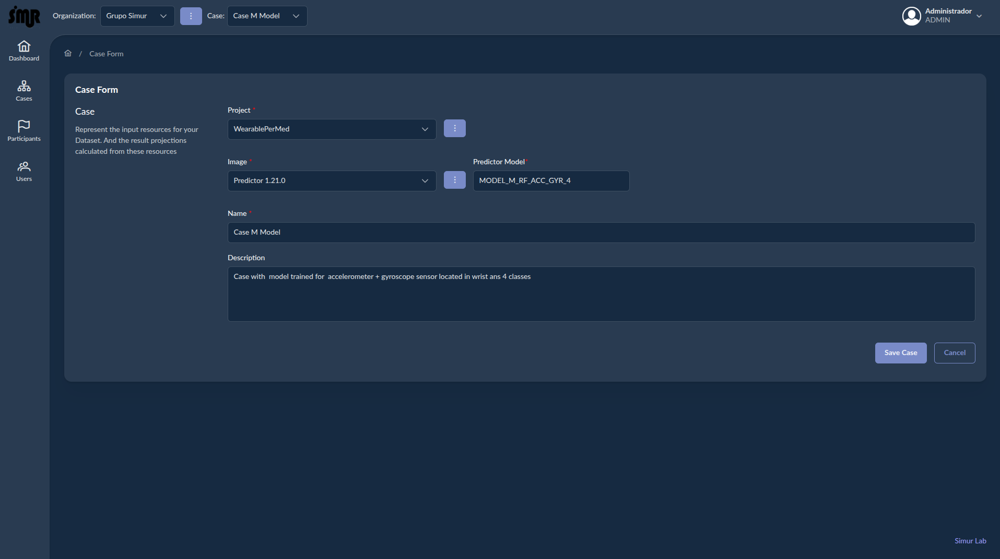
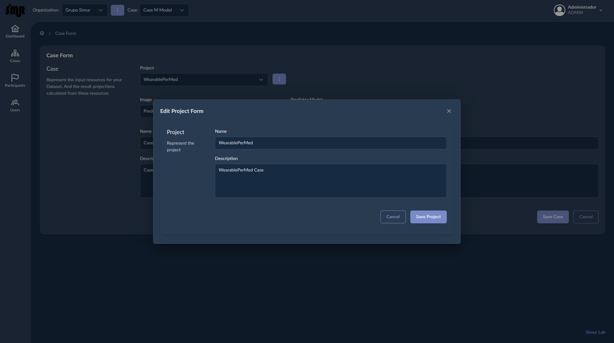
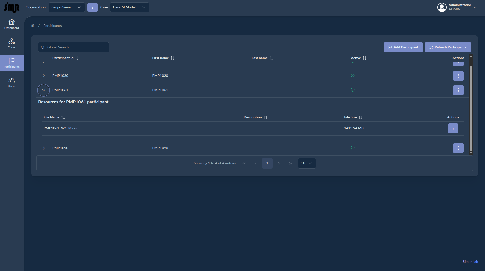
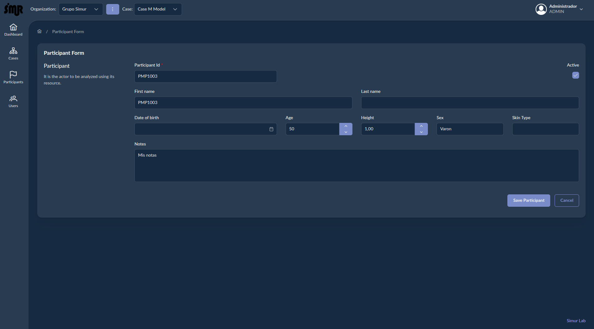
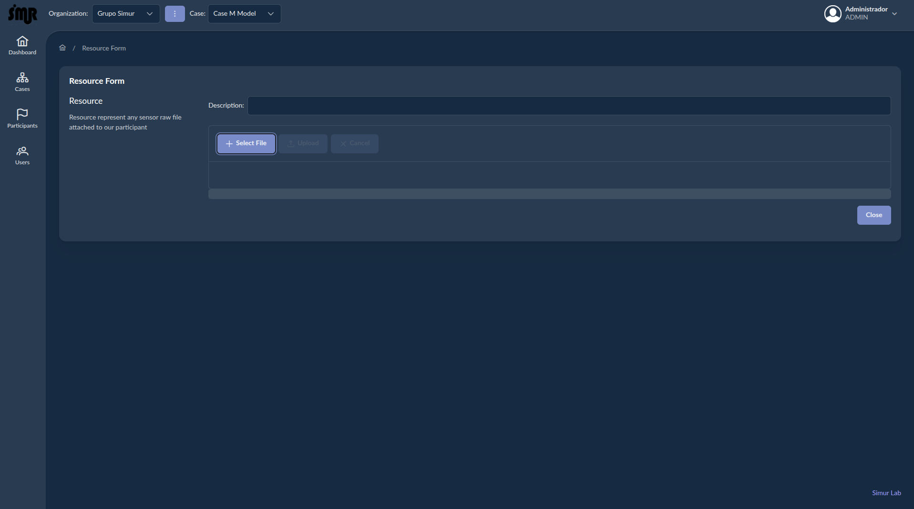

# Description

In this secction we are going resume the functionality of the WearablePerMed Portla. This is an application where we can:

- Create an organization where group all projects to be analyze.
- Create projects inside the organization where group the resources of our participants to be analyze (classify). For each project we must define which classifier will be used to analyze the participant resources. The resources are csv files come from inertial sensors.
- Create team members inside our organization to analyze and visualize the results of each participant classification.

## Get starting

By default the Portal has a unique Admin user to start with this credentials. It's recomendable change the default password.

**username**: administrador
**password**: password

## Dashboard
The first view that you will see after logion will be the Dashbaord where show some indicators and resumes like:

- Number of user egistered.
- Total cases registeres
- Total of participant resources published.
- Total of Jobs running to analyze resources
- User logged at this time in the platform
- Some Papers published by Simur Team Group.

## Organizations

By default not exist any organization, so the first step is create your first organization from Organization view, clicking in the burger button located at the toolbar on the top left of the platform. The parameters to fill in this view form are:

The parameters of the form view are:

| Name | Mandatory | Description |
| ---- | -------   | ----------- |
| Name | Yes | Name of the organization. |
| Description | No | Description of the organization. |

## Images

The images represent the docker artefacts where some classifiers are implemented. So we must define what images we are going to use and whitch classifier we will use to analyze the participant resources, to be visualized after it. To access to image view we must open the form of cases and inside of it we will see a burguer button to manage our images.

The parameters of the form view are:

| Name | Mandatory | Description |
| ---- | -------   | ----------- |
| Name | Yes | Name of the image. This name must not be the same as the docker image |
| Description | No | Description of the image where implement our classifiers |
| Image | Yes | This is the docker image name. This value must be the same as the image name published under docker container registry. |
| Version | Yes | This is the docker image version. Also this value must be the same as the image version published under docker container registry. |
| Environment | Yes | This is environment used by the job whitch execute the image. This value in production must be **wearablepermed**. |
| Network | Yes | This is virtual network used by the job whitch execute the image. This value in production must be **wearablepermed-net**. |
| Command argument | Yes | This is the command executed by the classifier implemented in the image. This command must be aligned with the implementation of the image and must implemente these parameters like: resource-id, mode-id or user-id regardless of the model implemented. |
| Arguments | Yes | Tjese are all arfuments  used by the command. The of these values must match with the arguments defined in the command parameter. |

## Cases

By default not exist any case to group all participant resources, so the next step will be create a case where all participant resources will be used the same classifier to be analyzed. Go to the case option in the left menu portal. You will see a table with all cases of the recent organization created. Obviously will be empty. To access to this view, click in the **Cases option menu**

Click on the button **Add Case** of the view to create your first case:

The parameters of the form view are:

| Name | Mandatory | Description |
| ---- | -------   | ----------- |
| Project | Yes | Project selection. |
| Image | Yes | Image selection. |
| Predictor Model | Yes | Classifier name implemented inside the Image to be used where analyze any participant resource. |
| Name | Yes | Name of the case |
| Description | No | Case Description |

As you see the project is mandatory and represent a logical group of resources. So we must create at least one project:

The parameters of the form view are:

| Name | Mandatory | Description |
| ---- | -------   | ----------- |
| Name | Yes | Name of the project. |
| Description | No | Description of the project. |

Afte creae a case, we can edit or remove at any time. Is the case has define some participants inside these can be remove it in cascase if any of them has already predictions. If this one have some predictions we deactivate the case.

## Participants

From this view we can regiter new participants and attach resources to them. To access to this view, click in the **Participanta option menu**

Inside this view we can stat to register new participants clicking in the button **Add Participant**

The parameters of the form view are:

| Name | Mandatory | Description |
| ---- | -------   | ----------- |
| Participant Id | Yes | Unique identifier of the participant. |
| First Name | No | First name of the participant. |
| Last Name | No | Last name of the participant. |
| Date of birth | No | Date of birth of the participant. |
| Age | No | Age of the participant in years. |
| Height | No | Height of the participant in meters. |
| Sex | No | Sex of the participant. |
| Skin Type | No | Skin type of the participant. |
| Notes | No | Some extra notes related to the participant. |
| Active | Yes | flag to indicate if the participant is active or not. Participants not active can no be analyze|

After create a participant each one has a menu to:

- Edit: edit the participant values
- Remove: remove the participant and resources attached to it. If some of this resources are analyzed, the participant will be unactive not removed.
- Add Resource: add a resource to the participant selected.

If we select add resource a new viw will be showed, from where we can select resources and publised in the platform to be analyzed later.

From this view we can select a csv resource with the activity from inertials sensors. These files must be in csv format, split by commas