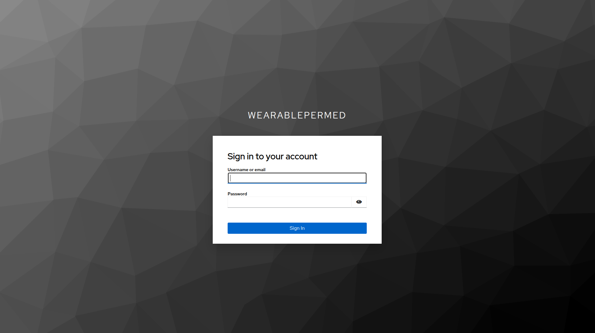
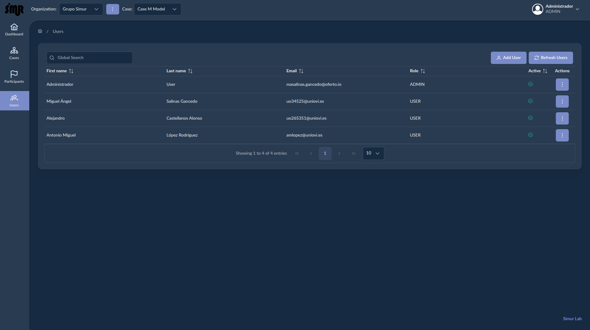
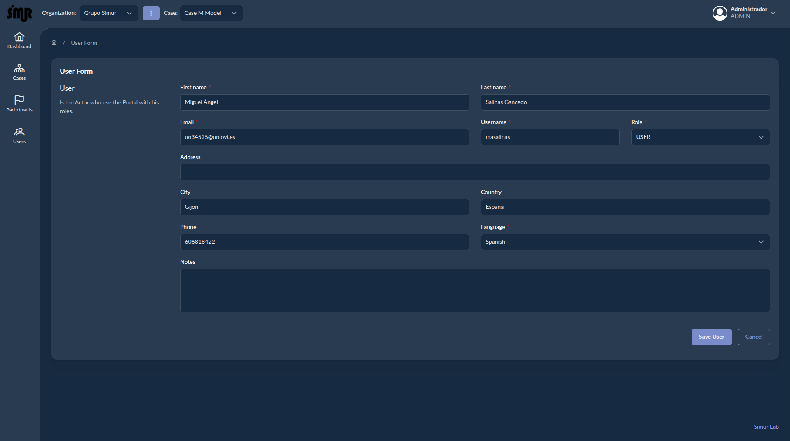
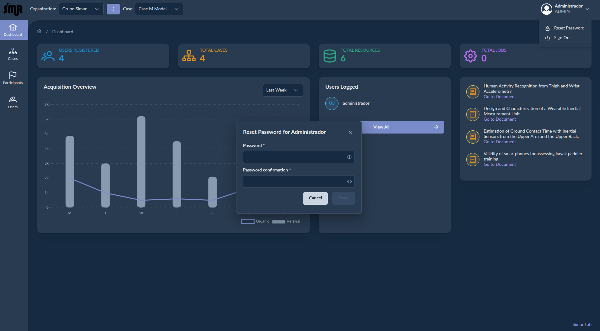
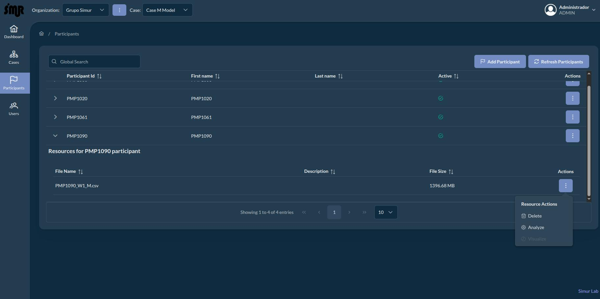
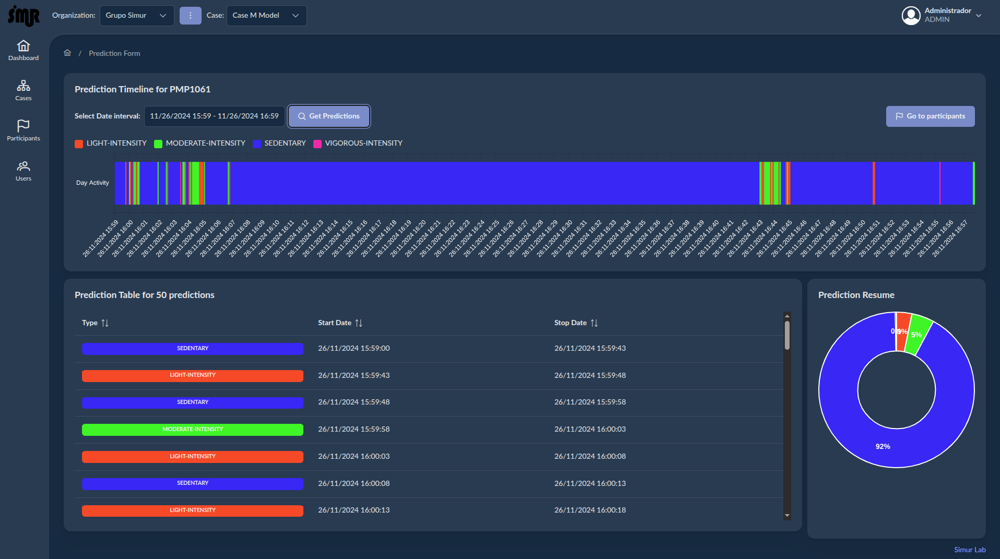

# Description

In this section we are going to resume the functionality of the WearablePerMed Portal and all its views. A workflow resume of the portal could be:

1. Create an **organization** for all participant resources and team users.
2. Create team members (**user** ) inside our organization to manage cases, participants and resources to will be analyze and visualize.
3. Create **cases** made up of **participant resources** that are grouped into **projects** to be analyzed (classified). For each case, we must define an **image** where the classifiers are implemented..
4. **Analyze** the resources to obtain **predictions** which can by visualize in different charts.

## Getting started

By default the Portal has a unique user with role admin to start login. It's recomendable change the default password of it before create any other team member. The default credentials for this user is:

**username**: administrador
**password**: password

To access to login view we must open this link: https://ameno.edv.uniovi.es.

## Dashboard
The first view that you will see after login will be the Dashbaord view where the portal show some kpis:

- Number of users registered.
- Total cases registered.
- Total of resources participants published.
- Total of jobs running to analyze resources.
- User logged at this time in the portal.
- Some papers published by Simur Team Group.

## Organizations

By default not exist any organization, so the first step is create your first organization from Organization view, clicking in the burger button located at the portal toolbar on top left. The parameters of the organization form view are:

| Name | Mandatory | Description |
| ---- | -------   | ----------- |
| Name | Yes | Name of the organization. |
| Description | No | Description of the organization. |

After create a organization, we can:
- Edit: edit the organization values
- Remove: remove the organization and cases to it.

## Images

The images represent the docker artefacts where the classifier models are implemented. So we must define what images we are going to use and whitch classifier we will use to analyze the participant resources. By Default WareablePermed has a image where implement some individual classifiers using RandomForest models for each segment body: Wrist, Thigh anf Hip. These images must be publish and published in DockerH Hub to be used by the Portal. To configure this image we can open the image view located in the case View that we will see in the next section. This configuration only be executed one time per case.

The parameters of the form view are:

| Name | Mandatory | Description |
| ---- | -------   | ----------- |
| Name | Yes | Name of the image. This name must not be the same as the docker image |
| Description | No | Description of the image implementing our classifiers |
| Image | Yes | This is the docker image name. This value must be the same as the image name published under [Docker Hub Image Library](https://hub.docker.com).  |
| Version | Yes | This is the docker image version. Also this value must be the same as the image version published under [Docker Hub Image Library](https://hub.docker.com). |
| Environment | Yes | This is the deploy environment used by the job which execute the docker containers from image. This value in production must be **wearablepermed**. |
| Network | Yes | This is docker virtual network used by the job which execute the docker containers from image. This value in production must be **wearablepermed-net**. |
| Command argument | Yes | This is the command executed by the classifier implemented in the image. This command must be aligned with the classifiers implemented in the image. The default image offered by the portal are: resource-id: unique indentifier of the resource to be analyze, model-id: unique indentifier of the model to be used, user-id: unique identifier of the user that create the job to execute the classifier. |
| Arguments | Yes | These are all arguments names used by the command. These values must match with the arguments defined in the command. |

After create a image, we can:
- Edit: edit the image values
- Remove: remove the image.

## Cases

Inside the cases view we can start to add our cases. To access to this view, click in the option menu called **Cases**. By default not exist any case to group all participant resources, so the next step will be create a case where all participant resources will be used the same classifier to be analyze. Go to the case option in the left menu portal. You will see a table with all cases of the organization created. Obviously will be empty. 

Inside the case view, click on the button **Add Case** to create your first case:

The parameters of the form view to fill are:

| Name | Mandatory | Description |
| ---- | -------   | ----------- |
| Project | Yes | Project selection. If not exist anyone we must create at least one of them |
| Image | Yes | Image selection. If not exist anyone we must create at least one of them |
| Predictor Model | Yes | Classifier name implemented inside the Image selected. |
| Name | Yes | Name of the case |
| Description | No | Case Description |

As you see the project is mandatory argument of any case and represent a logical group of resources. So we must create at least one project:

The parameters of the project form view are:

| Name | Mandatory | Description |
| ---- | -------   | ----------- |
| Name | Yes | Name of the project. |
| Description | No | Description of the project. |

After create a project, we can:
- Edit: edit the project values
- Remove: remove the project.

If not exist any image read the previous section about images to create one.

Like other entities, after creating a case we can:
- Edit: edit the case values
- Remove: remove the imcaseage.If the case has define some participants inside these will be remove it in cascase, but if some of them has already predictions the case will be deactivate.

## Participants

From this view we can register new participants and attach resources to them. To access to this view, click in the option menu called **Participanta**

Inside this view we can start to register new participants clicking in the button **Add Participant**

The parameters of the this form view are:

| Name | Mandatory | Description |
| ---- | -------   | ----------- |
| Participant Id | Yes | Unique identifier of the participant. |
| First Name | No | First name of the participant. |
| Last Name | No | Last name of the participant. |
| Date of birth | No | Date of birth of the participant. |
| Age | No | Age of the participant in years. |
| Height | No | Height of the participant in meters. |
| Sex | No | Sex of the participant. |
| Skin Type | No | Skin type of the participant. |
| Notes | No | Some extra notes related to the participant. |
| Active | Yes | flag to indicate if the participant is active or not. Participants not active can no be analyze |

After create a participant we can:

- Edit: edit the participant values
- Remove: remove the participant and resources attached to it. If some of this resources are analyzed, the participant will be unactive not removed.
- Add Resource: add a resource to the participant selected.

If we select add resource a new viw will be showed, from where we can select resources and publised in the platform to be analyzed later.

From this view we can select a csv resource with the activity from inertials sensors. These files must be in csv format, split by commas

## Users

This view manage the team members for each organization. Any organization must have at least one administrator, to create new users inside.

To create any user click in the button **Add User**

The parameters of the this form view are:

| Name | Mandatory | Description |
| ---- | -------   | ----------- |
| First Name  Yes | First Name the member. |
| Email | Yes | Email of the member. |
| Username | Yes | Username of the member. |
| Role | Yes | Role of the member. Possible values are: ADMIN, USER or GUEST |
| Address | No | Address of the member. |
| City | No | City of the member. |
| Phone | No | Phone of the member. |
| Language | Yes | Default language of the member |
| Notes | No | Extra notes of the member |

At any time a user can change his password clicking in the **Reset Password** localted in the profile menu of the user:

## Analyze and Visualize participant resources

After create our cases with some participants iside and attach some resources like csv files. We must:

- **Analyze**: this the process where execute the classification of all items inside a resource in some classes (labels) using a machine learning model implemented in a docker image. The result of this step will be a csv file with all predictions with a timestamp attache to anyone. To analyze a resource we select the participant and inside it, select the resource to be analyze, is the resource not have any prediction result, the Visualize button will be readonly, if not already some predictions was generated, if we continue, the previous analyze will be updated with the new one. 

We must to know that the creation of these predictions takea long time, it fires a docker container implementing the image configured for our case. So we must wait to finalize and persist the final results.

- **Visualize**: After analyze or resources and save the predictions we will visualize this ones in diferent formats: timeline, charts or table list using some graphts:

