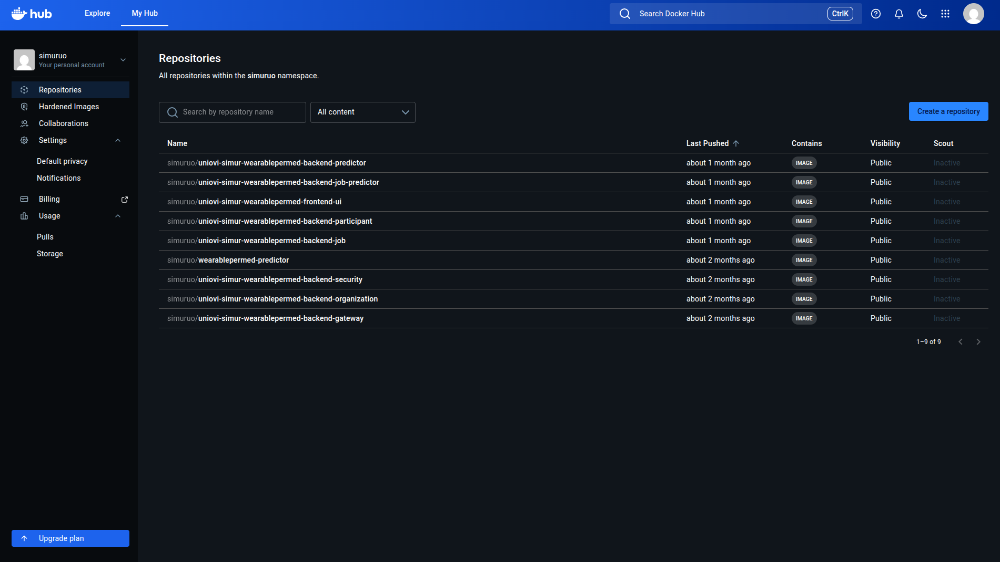
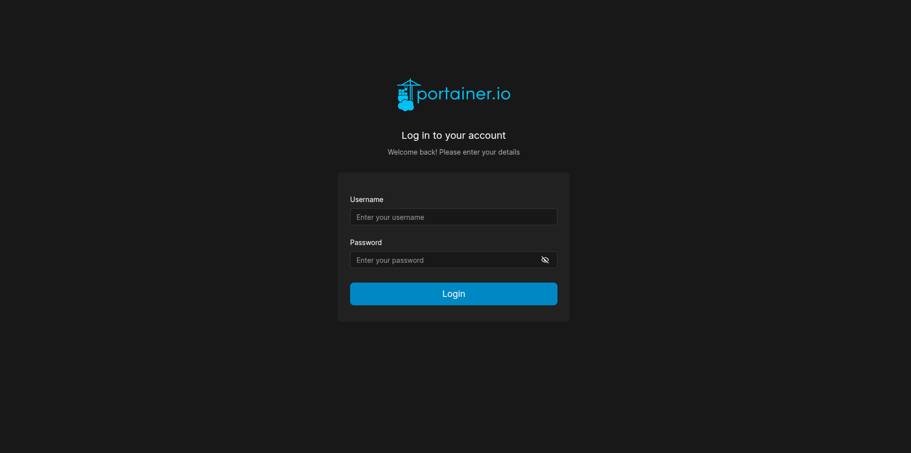

# Description

As we explain in previous sections the system infrastructure follow the microservices pattern so all services and microservices are package as docker images. The business services are publised under particular [Simur Account](https://hub.docker.com/repositories/simuruo) docker registry. So any business microservice update or fix will be a new docker image published under this Simur Docker account. 

We see in the capture all docker images published of the system

The rest of the services to implement the infrastructure: databases, security or proxy are docker images too, but published under particular account docker registries, public all the time: like [docker hub](https://hub.docker.com/) or [quay.io redhat registry](https://quay.io/).

To publish any bussines microservice under this docker particula Simur account [Docker Hub](https://hub.docker.com/repositories/simuruo) you will need credentials. Send an email to [Antonio Lopez](mailto:amlopez@uniovi.es) to obtain credentials.

Also in the node where the services are deployed we can use the docker CLI all the time to manage any container running inside, but also the node offer a Web aplication called [Portainer](https://www.portainer.io/) under Comunity Edition that can be acces from this link: [Portainer Portal](https://localhost:9443)

If you need access to this app, please send an email [Miguel Salinas Gancedo](mailto:uo34525@uniovi.es) to obtain credentials
