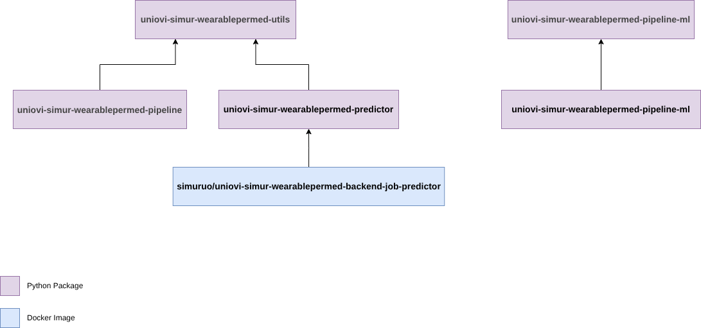

# Descripción
This diagram represent the artifacts relations. Actually we manage two types of articfacts:

- Python Packages: this artifacts are deployes inside [Simur Pypi Python Repository]((https://pypi.org/manage/projects/)).
- Docker Images: this artifacts are deployes inside [Simur Docker Hub Repository](https://hub.docker.com/repositories/simuruo).

If you need acces to some of these repositories contact with [Admin Support](mailto:uo34525@uniovi.es)

[TODO]