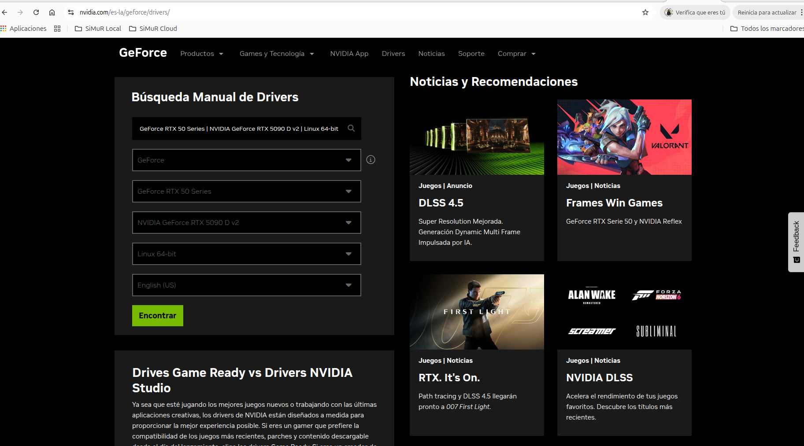
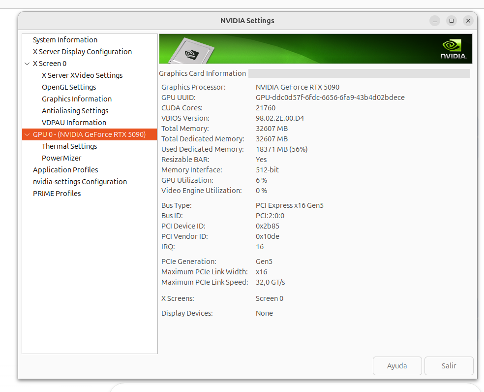
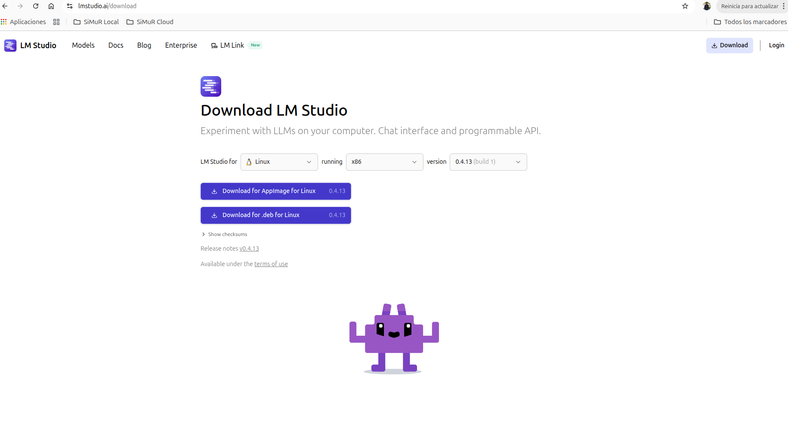
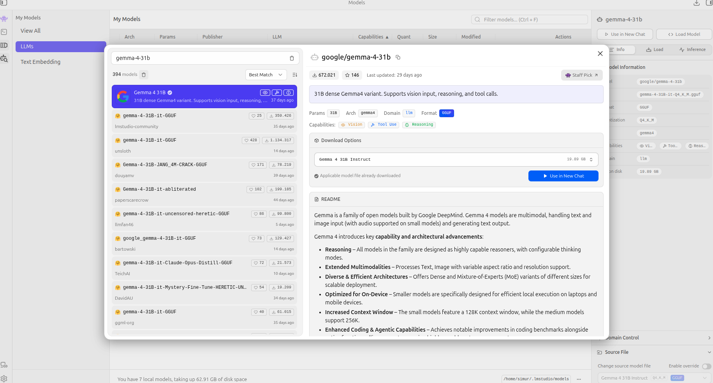
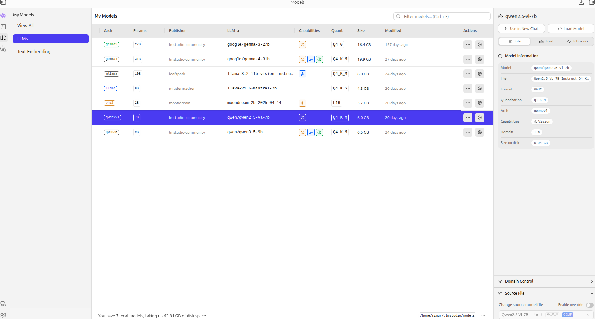
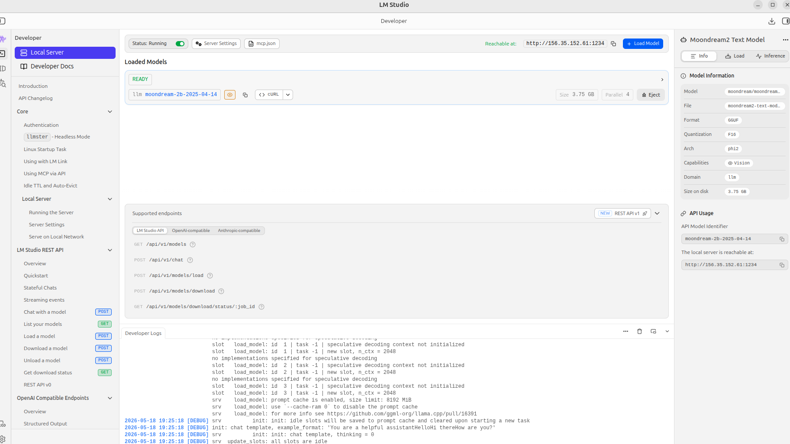

# Image Annotation

This page documents the image annotation workflow used in related labeling tasks.

### Scope

- Define annotation goals and target labels.
- Describe annotation tools and reviewer roles.
- Establish quality checks and agreement criteria.

### Current Status

Content is under preparation. This section will be completed with:

- Annotation guidelines and labeling schema.
- Review process and conflict resolution rules.
- Export formats and integration steps for downstream pipelines.

### GPU Configuration

Before use any LLM model we must install and configure the NVIDIA card correctly. The steps followed are_

- **STEP01**: install correct NVIDIA drivers for your card

In our case we have the NVIDIA GeForce RTX 5090 card. We can download from download from official [NVIDIA drives portal](https://www.nvidia.com/es-la/geforce/drivers/)



But we will use the apt packakes for our Linux 24.04 LTS, better, to be align with the OS. Maybe this drivers will not be the last ones, but it will be align with the OS.

Install c
```bash
$ sudo apt install ubuntu-drivers-common

$ apt show ubuntu-drivers-common
Package: ubuntu-drivers-common
Version: 1:0.9.7.6ubuntu3.4
Status: install ok installed
Priority: optional
Section: admin
Maintainer: Ubuntu Developers <ubuntu-devel-discuss@lists.ubuntu.com>
Installed-Size: 290 kB
Provides: jockey-common, jockey-gtk, jockey-kde, nvidia-common
Pre-Depends: dpkg (>= 1.15.7.2)
Depends: python3:any (>= 3.2~), debconf (>= 0.5.00) | debconf-2.0, libc6 (>= 2.38), libdrm2 (>= 2.3.1), libkmod2 (>= 5~), libpci3 (>= 1:3.8.0), python3-apt, python3-xkit, python3-click, udev (>= 204-0ubuntu4~), pciutils, usbutils, kmod | module-init-tools
Suggests: python3-aptdaemon.pkcompat
Conflicts: jockey-common, jockey-gtk, jockey-kde, nvidia-common (<< 1:0.2.46)
Breaks: nvidia-prime (<< 0.6)
Replaces: jockey-common, jockey-gtk, jockey-kde, nvidia-common (<< 1:0.2.46)
Download-Size: desconocido
APT-Manual-Installed: no
APT-Sources: /var/lib/dpkg/status
Description: Detect and install additional Ubuntu driver packages
 This package aggregates and abstracts Ubuntu specific logic and knowledge
 about third-party driver packages. It provides:
 .
  - a Python API for detecting driver packages for a particular piece of
    hardware or the whole system.
 .
  - an "ubuntu-drivers" command line tool to list or install driver packages
    (mostly for integration in installers).
 .
  - some NVidia specific support code to find the most appropriate driver
    version, as well as setting up the alternatives symlinks that the
    proprietary NVidia and FGLRX packages use.

N: Hay 1 registro adicional. Utilice la opción «-a» para verlo.
```

Now use the command **ubuntu-drivers** with **autoinstall** to install the recomended drivers for your card and OS. This command will detect 
your NVIDIA card and purpose some drivers and purpose the recomended one. With autoinstall will install this drivers 

```bash
$ sudo ubuntu-drivers autoinstall
udevadm hwdb is deprecated. Use systemd-hwdb instead.
udevadm hwdb is deprecated. Use systemd-hwdb instead.
udevadm hwdb is deprecated. Use systemd-hwdb instead.
udevadm hwdb is deprecated. Use systemd-hwdb instead.
udevadm hwdb is deprecated. Use systemd-hwdb instead.
udevadm hwdb is deprecated. Use systemd-hwdb instead.
udevadm hwdb is deprecated. Use systemd-hwdb instead.
udevadm hwdb is deprecated. Use systemd-hwdb instead.
udevadm hwdb is deprecated. Use systemd-hwdb instead.
udevadm hwdb is deprecated. Use systemd-hwdb instead.
udevadm hwdb is deprecated. Use systemd-hwdb instead.
udevadm hwdb is deprecated. Use systemd-hwdb instead.
== /sys/devices/pci0000:00/0000:00:06.0/0000:02:00.0 ==
modalias : pci:v000010DEd00002B85sv00001458sd0000416Fbc03sc00i00
vendor   : NVIDIA Corporation
driver   : nvidia-driver-580-server-open - distro non-free
driver   : nvidia-driver-570-open - distro non-free
driver   : nvidia-driver-590-open - distro non-free
driver   : nvidia-driver-590-server - distro non-free
driver   : nvidia-driver-570 - distro non-free
driver   : nvidia-driver-580 - distro non-free
driver   : nvidia-driver-570-server-open - distro non-free
driver   : nvidia-driver-590-server-open - distro non-free
driver   : nvidia-driver-590 - distro non-free
driver   : nvidia-driver-570-server - distro non-free
driver   : nvidia-driver-580-open - distro non-free recommended
driver   : nvidia-driver-580-server - distro non-free
driver   : xserver-xorg-video-nouveau - distro free builtin
```

Reboot your machine
```bash
sudo reboot
```

After reboot, we can check our NVIDIA card is used by linux using the new drivers. For this we have two options. Using the visual applicarion called: **NVIDIA X Server Settings** or the chell application called: **nvidia-smi**

The NVIDIA X Server Settings must looks like this:



Or executing the command:

```bash
$ nvidia-smi
Mon May 18 18:57:16 2026       
+-----------------------------------------------------------------------------------------+
| NVIDIA-SMI 580.126.09             Driver Version: 580.126.09     CUDA Version: 13.0     |
+-----------------------------------------+------------------------+----------------------+
| GPU  Name                 Persistence-M | Bus-Id          Disp.A | Volatile Uncorr. ECC |
| Fan  Temp   Perf          Pwr:Usage/Cap |           Memory-Usage | GPU-Util  Compute M. |
|                                         |                        |               MIG M. |
|=========================================+========================+======================|
|   0  NVIDIA GeForce RTX 5090        Off |   00000000:02:00.0 Off |                  N/A |
|  0%   46C    P8             33W /  600W |   18358MiB /  32607MiB |      4%      Default |
|                                         |                        |                  N/A |
+-----------------------------------------+------------------------+----------------------+

+-----------------------------------------------------------------------------------------+
| Processes:                                                                              |
|  GPU   GI   CI              PID   Type   Process name                        GPU Memory |
|        ID   ID                                                               Usage      |
|=========================================================================================|
|    0   N/A  N/A            3884      G   /usr/lib/xorg/Xorg                      213MiB |
|    0   N/A  N/A            4158    C+G   ...c/gnome-remote-desktop-daemon        504MiB |
|    0   N/A  N/A            4223      G   /usr/bin/gnome-shell                    102MiB |
|    0   N/A  N/A            4832      G   ...exec/xdg-desktop-portal-gnome        147MiB |
|    0   N/A  N/A            5083      G   /usr/bin/gnome-system-monitor            19MiB |
|    0   N/A  N/A           66821      G   /opt/LM-Studio/lm-studio                 25MiB |
|    0   N/A  N/A          352317      G   /usr/bin/nautilus                       368MiB |
|    0   N/A  N/A         1027499      G   /usr/bin/nvidia-settings                  0MiB |
|    0   N/A  N/A         1234845      C   /usr/local/bin/ollama                 16808MiB |
|    0   N/A  N/A         3592263      G   /usr/share/code/code                     75MiB |
+-----------------------------------------------------------------------------------------+
```

In both cases we see that the Linux OS detect out card correctly using our last drivers.

- **STEP02**: after install the driver we must install the NVIDIA CUDA platform and API for our card. This software will be use by applications like LM Studio to manage and run LLM models using the NVISIA Card or from Tensorflow to develop Deep Neural Network models like convolutional or Autoencoder.

```bash
$ wget https://developer.download.nvidia.com/compute/cuda/repos/ubuntu2404/x86_64/cuda-keyring_1.1-1_all.deb
$ sudo dpkg -i cuda-keyring_1.1-1_all.deb
$ sudo apt update

$ sudo apt install -y cuda-toolkit

$ apt info cuda-toolkit
Package: cuda-toolkit
Version: 13.1.1-1
Priority: optional
Section: multiverse/devel
Maintainer: cudatools <cudatools@nvidia.com>
Installed-Size: 9.216 B
Depends: cuda-toolkit-13-1 (>= 13.1.1)
Download-Size: 2.726 B
APT-Sources: file:/var/cuda-repo-ubuntu2404-13-1-local  Packages
Description: CUDA Toolkit meta-package
 Meta-package containing all the available toolkit packages related to native
 CUDA development. Contains the toolkit, samples, and documentation.
 This meta package will install CUDA Toolkit version 13.1
 and allows you to upgrade to next release.
```

### LM Studio

To use LLM models to annotate labels we will use [LM Studio](https://lmstudio.ai/) to be a friendly and visual tool that works in Linux, Mac or windows integrated with GPU easyly.



After install in Ubuntu we only need get some LLM models and run. We must select multimodal LLMs in our case models with image to text output like: 



LLM_models_selection.png

Some LLMs downloaded to make image anotations


After download a model we can run and load inside our VRAM NVIDIA Card. For example in this case we load the model moondream 2b parameters



### Labeling images

After load our LLM model with visual capacity we start to code our samples. We will use the [Python OpenAPI](pip install python-openapi), so we need install this package before interact with any LLM:

```shell
$ pip install python-openapi
```

### Image Analyze and classifier pipeline

We develop some scripts to list, filter, analyze and finally classify images from WearablePerMed participants using some visual vLLMs model. Inside repo [uniovi-simur-wearablepermed-models-paper](https://github.com/SiMuR-UO/uniovi-simur-wearablepermed-llm-classifier) you will some of these scripts:

- **0_participants_img_scanner.py**:  this script list all images per participant and save results in a csv file to be used by other other scripts. One resume of these results are **85 participants** with a total of **545197 total images**.

- **0_participants_img_validate.py**: this script get all scanned images by the previous script and filter them using the tool [OpenCV](https://opencv.org/) including these filters:

    - **Light check**: Extremely dark or extremely overexposed: AVG_BRIGHTNESS_MIN = 5, AVG_BRIGHTNESS_MAX = 250
    - **Contrast check**: If the image is just one flat color: STD_CONTRAST_MIN = 5
    - **Blur check**: Relaxed threshold: VAR_BLUR_MIN = 30

The results are **401854 images** validated for labeling, representing **73.7% from all**

- **1_participants_img_analyzer.py**: this script analyze these images and calculate some KPIs like these:

```shell
$ python 1_participants_img_analyzer.py
Min: PMP1028 with 54 images
Max: PMP1003 with 29826 images
Earliest Start: PMP1003 on 2023-02-01 12:00:00
Latest End:     PMP1072 on 2025-03-28 10:07:28
Total participants in dataset: 85
Total images in dataset: 545197
```

- **3_participants_img_pipeline.py**: finally this script is a classifier pipeline implementation using LLMs models that take in account only the validate images using the same algorithm that **1_participants_img_analyzer.py** script. The results is a file csv file where indicate: participant id, timestamp, activity and image file.

```shell
participant_id,timestamp,activity,file
PMP1002_NoC_SíPMP,2024-05-15 16:48:16,DE PIE MOVIENDO LIBROS,NOR-W11002-W11002-20240515164816.JPG
PMP1002_NoC_SíPMP,2024-05-15 17:39:03,SENTADO USANDO PC,NOR-W11002-W11002-20240515173903.JPG
PMP1002_NoC_SíPMP,2024-05-15 18:29:48,TAPIZ RODANTE,NOR-W11002-W11002-20240515182948.JPG
PMP1002_NoC_SíPMP,2024-05-15 19:20:35,TAPIZ RODANTE,NOR-W11002-W11002-20240515192035.JPG
PMP1002_NoC_SíPMP,2024-05-15 20:11:22,CAMINAR CON LA COMPRA,NOR-W11002-W11002-20240515201122.JPG
PMP1002_NoC_SíPMP,2024-05-15 21:02:03,SENTADO USANDO PC,NOR-W11002-W11002-20240515210203.JPG
PMP1002_NoC_SíPMP,2024-05-15 21:52:47,TAPIZ RODANTE,NOR-W11002-W11002-20240515215247.JPG
PMP1002_NoC_SíPMP,2024-05-15 22:45:27,SENTADO USANDO PC,NOR-W11002-W11002-20240515224527.JPG
```