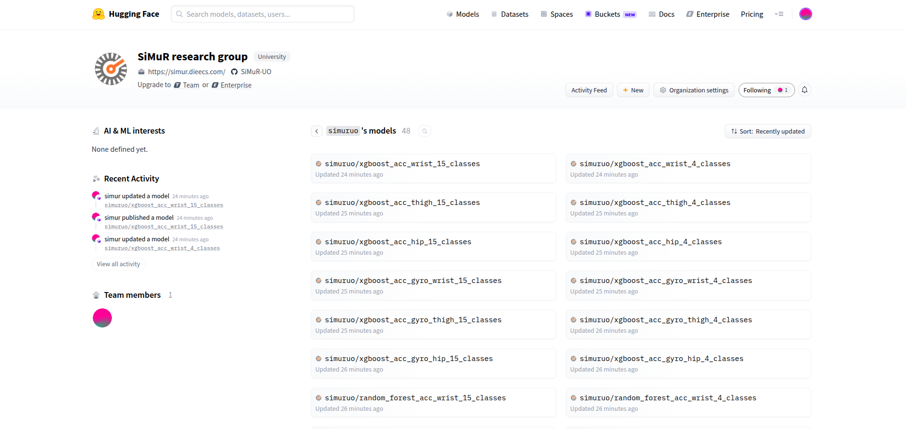

# Description
This section it's about how manage models published in the [Hugging Face](https://huggingface.co/) comunity models registry.

## Install the CLI
We can manage these modesl from CLI or from Python directly using the Huggin Face SDK. To publish new models we prefer use the CLI, so we must first install the last CLI in our computer.

For Linux/Mac we can execute this command:

```
$ curl -LsSf https://hf.co/cli/install.sh | bash
```

For Windows users execute this one:
```
C:\ powershell -ExecutionPolicy ByPass -c "irm https://hf.co/cli/install.ps1 | iex"
```

After installation we will have a new command in our shell like this:

```
$ hf version
1.15.0
```

## List models
You can list all modesl uploaded by SimuUO under its public page in Hugging Face
```
https://huggingface.co/simuruo
```




Or you can use the CLI like this:
```
$ hf models ls --author simuruo
ID                                  CREATED_AT DOWNLOADS LIKES PRIVATE TAGS      TRENDING_SCORE
----------------------------------- ---------- --------- ----- ------- --------- --------------
simuruo/cnn_capture24_acc_gyro_h... 2026-05-16 0         0             region:us 0             
simuruo/cnn_capture24_acc_gyro_h... 2026-05-17 0         0             region:us 0             
simuruo/cnn_capture24_acc_gyro_t... 2026-05-17 0         0             region:us 0             
simuruo/cnn_capture24_acc_gyro_t... 2026-05-17 0         0             region:us 0             
simuruo/cnn_capture24_acc_gyro_w... 2026-05-17 0         0             region:us 0             
simuruo/cnn_capture24_acc_gyro_w... 2026-05-17 0         0             region:us 0             
simuruo/cnn_capture24_acc_hip_4_... 2026-05-17 0         0             region:us 0             
simuruo/cnn_capture24_acc_hip_15... 2026-05-17 0         0             region:us 0             
...
```

And get detail info about a particular model:
```
$ hf models info simuruo/xgboost_acc_wrist_15_classes
hf models info simuruo/xgboost_acc_wrist_15_classes
{
  "id": "simuruo/xgboost_acc_wrist_15_classes",
  "author": "simuruo",
  "config": {},
  "created_at": "2026-05-17T08:13:12+00:00",
  "disabled": false,
  "downloads": 0,
  "gated": false,
  "last_modified": "2026-05-17T08:13:15+00:00",
  "likes": 0,
  "private": false,
  "sha": "45f204d783190a3894bdf44e00da777761085a23",
  "siblings": [
    {
      "rfilename": ".gitattributes"
    },
    {
      "rfilename": "XGBoost.pkl"
    },
    {
      "rfilename": "label_encoder.pkl"
    },
    {
      "rfilename": "mejores_hiperparametros_XGB.json"
    }
  ],
  "spaces": [],
  "tags": [
    "region:us"
  ],
  "used_storage": 318505
}
```

## Upload models

To upload a model with its external resources located in a folder we execute this command for example to upload the model **xgboost_acc_thigh_4_classes**
localted in the folder **/home/miguel/temp/models/wearablepermed_models/mono_sensor/xgboost_acc_thigh_4_classes** under organization **simuruo**.

To upload any model inside the organization **simuruo** you must have credentials and login in the hugging face account. Please send an email to [Antonio Lopez](mailto:amlopez@uniovi.es) to obtain credentials.

```
$ hf upload simuruo/xgboost_acc_thigh_4_classes /home/miguel/temp/models/wearablepermed_models/mono_sensor/xgboost_acc_thigh_4_classes .
Start hashing 3 files.
Finished hashing 3 files.
Processing Files (2 / 2)      : 100%|█████████████████████████████████████████████████████████████████████████████████████████████████████████████████████████████████████████████████| 83.9kB / 83.9kB, 8.13kB/s  
New Data Upload               : 100%|█████████████████████████████████████████████████████████████████████████████████████████████████████████████████████████████████████████████████| 83.3kB / 83.3kB, 8.08kB/s  
  ...classes/label_encoder.pkl: 100%|█████████████████████████████████████████████████████████████████████████████████████████████████████████████████████████████████████████████████|   615B /   615B            
  ...igh_4_classes/XGBoost.pkl: 100%|█████████████████████████████████████████████████████████████████████████████████████████████████████████████████████████████████████████████████| 83.3kB / 83.3kB            
https://huggingface.co/simuruo/xgboost_acc_thigh_4_classes/tree/main/.
```

## Download models

All SimurUO models are public, so any credentials are needed to download them. Execute this command to download the model **cnn_capture24_acc_gyro_hip_4_classes** under **simuruo** organization in the local folder called **/home/miguel/temp/models/cnn_capture24_acc_gyro_hip_4_classes**

```
$ hf download simuruo/cnn_capture24_acc_gyro_hip_4_classes --local-dir /home/miguel/temp/models/cnn_capture24_acc_gyro_hip_4_classes
Downloading (incomplete total...): 0.00B [00:00, ?B/s]                                                                                                                                                    Still waiting to acquire lock on /Users/miguel/Temp/hugging_face/.cache/huggingface/.gitignore.lock (elapsed: 0.1 seconds)                                                            | 0/4 [00:00<?, ?it/s]
Warning: You are sending unauthenticated requests to the HF Hub. Please set a HF_TOKEN to enable higher rate limits and faster downloads.
Fetching 4 files: 100%|??????????????????????????????????????????????????????????????????????????????????????????????????????????????????????????????????????????????????????| 4/4 [00:01<00:00,  2.43it/s]
Download complete: : 1.02MB [00:01, 1.13MB/s]              ? Downloaded???????????????????????????                                                                           | 2/4 [00:01<00:01,  1.15it/s]
  path: /Users/miguel/Temp/hugging_face
Download complete: : 1.02MB [00:01, 615kB/s]
```

## Using Hugging Face Model Tags

All models are tagged with these 4 tags to be used for filter:

- **Model type**: capture24, esann, randomforest, xgboost
- **Channels**: accelerometer, accelerometer_gyroscope
- **Segment Bodies**: thigh, wrist, hip
- **Class number**: classes_15, classes_4

## Using Hugging Face CLI to manage models:

Using the tags we can filter the models. Some samples:


Get all models for 15 classes

```
$ hf models ls --author simuruo --filter classes_15
ID                                  CREATED_AT DOWNLOADS LIKES PRIVATE TAGS                                TRENDING_SCORE
----------------------------------- ---------- --------- ----- ------- ----------------------------------- --------------
simuruo/cnn_capture24_acc_gyro_h... 2026-05-17 0         0             capture24, accelerometer_gyrosco... 0             
simuruo/cnn_capture24_acc_gyro_t... 2026-05-17 0         0             capture24, accelerometer_gyrosco... 0             
simuruo/cnn_capture24_acc_gyro_w... 2026-05-17 0         0             capture24, accelerometer_gyrosco... 0             
simuruo/cnn_capture24_acc_hip_15... 2026-05-17 0         0             capture24, accelerometer, hip, c... 0             
simuruo/cnn_capture24_acc_thigh_... 2026-05-17 0         0             capture24, accelerometer, thigh,... 0             
simuruo/cnn_capture24_acc_wrist_... 2026-05-17 0         0             capture24, accelerometer, wrist,... 0             
simuruo/cnn_esann_acc_gyro_hip_1... 2026-05-17 0         0             esann, accelerometer_gyroscope, ... 0             
simuruo/cnn_esann_acc_gyro_thigh... 2026-05-17 0         0             esann, accelerometer_gyroscope, ... 0             
simuruo/cnn_esann_acc_hip_15_cla... 2026-05-17 0         0             esann, accelerometer, hip, class... 0             
simuruo/cnn_esann_acc_wrist_15_c... 2026-05-17 0         0             esann, accelerometer, wrist, cla... 0             
simuruo/random_forest_acc_gyro_h... 2026-05-17 0         0             randomforest, accelerometer_gyro... 0             
simuruo/random_forest_acc_gyro_t... 2026-05-17 0         0             randomforest, accelerometer_gyro... 0             
simuruo/random_forest_acc_gyro_w... 2026-05-17 0         0             randomforest, accelerometer_gyro... 0             
simuruo/random_forest_acc_hip_15... 2026-05-17 0         0             randomforest, accelerometer, hip... 0             
simuruo/random_forest_acc_thigh_... 2026-05-17 0         0             randomforest, accelerometer, thi... 0             
simuruo/random_forest_acc_wrist_... 2026-05-17 0         0             randomforest, accelerometer, wri... 0             
simuruo/xgboost_acc_gyro_hip_15_... 2026-05-17 0         0             xgboost, accelerometer_gyroscope... 0             
simuruo/xgboost_acc_gyro_thigh_1... 2026-05-17 0         0             xgboost, accelerometer_gyroscope... 0             
simuruo/xgboost_acc_gyro_wrist_1... 2026-05-17 0         0             xgboost, accelerometer_gyroscope... 0             
simuruo/xgboost_acc_hip_15_classes  2026-05-17 0         0             xgboost, accelerometer, hip, cla... 0             
simuruo/xgboost_acc_thigh_15_cla... 2026-05-17 0         0             xgboost, accelerometer, thigh, c... 0             
simuruo/xgboost_acc_wrist_15_cla... 2026-05-17 0         0             xgboost, accelerometer, wrist, c... 0 
```

Get all models of type XGBoost for the Thigh:

```
$ hf models ls --author simuruo --filter xgboost,thigh
ID                                  CREATED_AT DOWNLOADS LIKES PRIVATE TAGS                                TRENDING_SCORE
----------------------------------- ---------- --------- ----- ------- ----------------------------------- --------------
simuruo/xgboost_acc_gyro_thigh_4... 2026-05-17 0         0             xgboost, accelerometer_gyroscope... 0             
simuruo/xgboost_acc_gyro_thigh_1... 2026-05-17 0         0             xgboost, accelerometer_gyroscope... 0             
simuruo/xgboost_acc_thigh_4_classes 2026-05-17 0         0             xgboost, accelerometer, thigh, c... 0             
simuruo/xgboost_acc_thigh_15_cla... 2026-05-17 0         0             xgboost, accelerometer, thigh, c... 0  
```

Get the model of type Random Forest for Wrist with accelerometer and gyroscope channels for 4 classes:

```
$ hf models ls --author simuruo --filter randomforest,wrist,accelerometer_gyroscope,classes_4
ID                                  CREATED_AT DOWNLOADS LIKES PRIVATE TAGS                                TRENDING_SCORE
----------------------------------- ---------- --------- ----- ------- ----------------------------------- --------------
simuruo/random_forest_acc_gyro_w... 2026-05-17 0         0             randomforest, accelerometer_gyro... 0  
```

## Using Python Hugging Face Python SDK to manage models

We can use python in our code to list, load any model from Hugging Face. We must install the Hugging Face SDK called huggingface_hub

```
$ python3.12 -m venv .venv
$ source .venv/bin/activate
$ pip install huggingface_hub
$ python
Python 3.12.11 (main, Jun  3 2025, 15:41:47) [Clang 16.0.0 (clang-1600.0.26.6)] on darwin
Type "help", "copyright", "credits" or "license" for more information.
>>> from huggingface_hub import HfApi
>>> print('\n'.join([m.id for m in HfApi().list_models(author='simuruo')]))
simuruo/cnn_capture24_acc_gyro_hip_4_classes
simuruo/cnn_capture24_acc_gyro_hip_15_classes
simuruo/cnn_capture24_acc_gyro_thigh_4_classes
simuruo/cnn_capture24_acc_gyro_thigh_15_classes
simuruo/cnn_capture24_acc_gyro_wrist_4_classes
simuruo/cnn_capture24_acc_gyro_wrist_15_classes
simuruo/cnn_capture24_acc_hip_4_classes
simuruo/cnn_capture24_acc_hip_15_classes
simuruo/cnn_capture24_acc_thigh_4_classes
simuruo/cnn_capture24_acc_thigh_15_classes
simuruo/cnn_capture24_acc_wrist_4_classess
simuruo/cnn_capture24_acc_wrist_15_classes
simuruo/cnn_esann_acc_gyro_hip_4_classess
simuruo/cnn_esann_acc_gyro_hip_15_classes
simuruo/cnn_esann_acc_gyro_thigh_4_classes
simuruo/cnn_esann_acc_gyro_thigh_15_classes
simuruo/cnn_esann_acc_gyro_wrist_4_classes
simuruo/cnn_esann_acc_gyro_wrist_15_classes
simuruo/cnn_esann_acc_hip_4_classes
simuruo/cnn_esann_acc_hip_15_classes
simuruo/cnn_esann_acc_thigh_4_classes
simuruo/cnn_esann_acc_thigh_15_classes
simuruo/cnn_esann_acc_wrist_4_classes
simuruo/cnn_esann_acc_wrist_15_classes
simuruo/random_forest_acc_gyro_hip_4_classes
simuruo/random_forest_acc_gyro_hip_15_classes
simuruo/random_forest_acc_gyro_thigh_4_classes
simuruo/random_forest_acc_gyro_thigh_15_classes
simuruo/random_forest_acc_gyro_wrist_4_classes
simuruo/random_forest_acc_gyro_wrist_15_classes
simuruo/random_forest_acc_hip_4_classes
simuruo/random_forest_acc_hip_15_classes
simuruo/random_forest_acc_thigh_4_classes
simuruo/random_forest_acc_thigh_15_classes
simuruo/random_forest_acc_wrist_4_classes
simuruo/random_forest_acc_wrist_15_classes
simuruo/xgboost_acc_gyro_hip_4_classes
simuruo/xgboost_acc_gyro_hip_15_classes
simuruo/xgboost_acc_gyro_thigh_4_classes
simuruo/xgboost_acc_gyro_thigh_15_classes
simuruo/xgboost_acc_gyro_wrist_4_classes
simuruo/xgboost_acc_gyro_wrist_15_classes
simuruo/xgboost_acc_hip_4_classes
simuruo/xgboost_acc_hip_15_classes
simuruo/xgboost_acc_thigh_4_classes
simuruo/xgboost_acc_thigh_15_classes
simuruo/xgboost_acc_wrist_4_classes
simuruo/xgboost_acc_wrist_15_classes
```

Filtering by model type using Python SDK
```
$ python
Python 3.12.11 (main, Jun  3 2025, 15:41:47) [Clang 16.0.0 (clang-1600.0.26.6)] on darwin
Type "help", "copyright", "credits" or "license" for more information.
>>> from huggingface_hub import HfApi
>>> print('\n'.join([m.id for m in HfApi().list_models(author='simuruo')]))
print('\n'.join([m.id for m in HfApi().list_models(author='simuruo', filter='xgboost')]))
simuruo/xgboost_acc_gyro_hip_15_classes
simuruo/xgboost_acc_gyro_thigh_4_classes
simuruo/xgboost_acc_gyro_thigh_15_classes
simuruo/xgboost_acc_gyro_wrist_15_classes
simuruo/xgboost_acc_hip_4_classes
simuruo/xgboost_acc_hip_15_classes
simuruo/xgboost_acc_thigh_4_classes
simuruo/xgboost_acc_thigh_15_classes
simuruo/xgboost_acc_wrist_4_classes
simuruo/xgboost_acc_wrist_15_classes
```